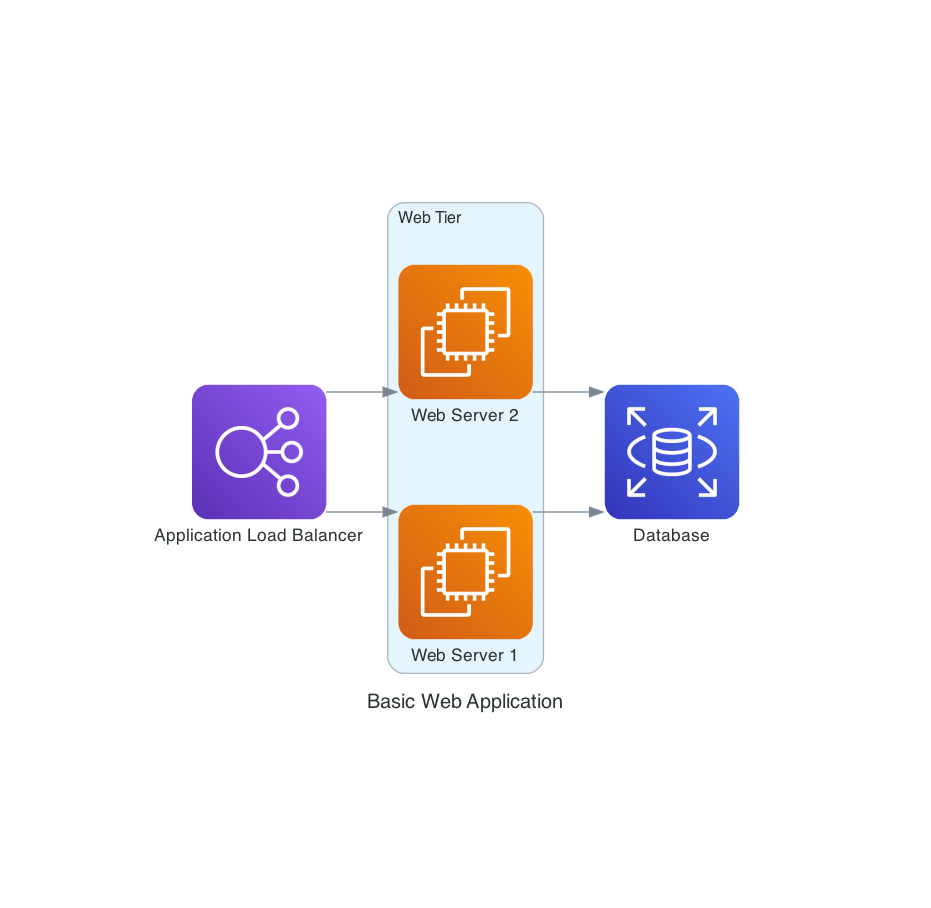
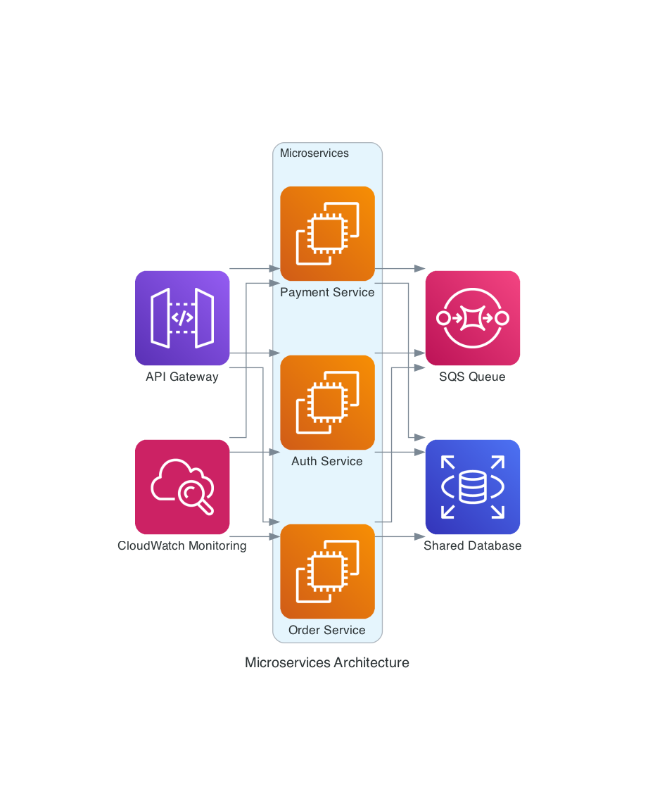

# AI Engineer Home Assignment

## Overview

Your task is to build an async, stateless Python API service that allows users to create diagrams using agents or multi-agents frameworks, powered by a Large Language Model (LLM).

The goal is to enable users to describe diagram components, nodes, or flow in natural language and get back a rendered image.

Examples of how the service is expected to work can be found on this page:
👉 [https://diagrams.mingrammer.com/](https://diagrams.mingrammer.com/)

---

## Requirements

* Use Python and an async framework (e.g. FastAPI, Starlette, etc.)
* Use **UV** for Python package management.
* The service must be **stateless** — no user session or database required.
* Containerize your project with **Docker**, and include a `docker-compose.yml` for easy setup.
* Agent(s) must operate through tools built around the **diagrams** package for Python.

  * Consider the package a “black box” for the LLM — Do not assume it has knowledge of the diagrams package.
  * Build your own tools that operate the package and can be used by the agent, in any way or architecture you see fit.
  * Instructions like *“write a code for python’s diagrams package”* or *“using the diagrams package for python”* are **not acceptable**.
  * Support **at least 3 node types** of your choice.
* Integrate with an LLM API of your choice (Gemini is recommended as it offers a free plan).
* All LLM prompt logic must be **visible and documented** in code (not hidden behind opaque framework calls).

---

## Core Functionality

The service should expose:

* An endpoint which generates and returns a **full diagram image** based on a natural language description.
* **(Bonus)** An assistant-style endpoint that understands the user's intent and responds helpfully — either by generating code, returning an image, explaining how to build the diagram, or asking questions back to understand better.

---

## Submission Guidelines

* Provide a `.env.example` or equivalent for configuration.
* Include a `README.md` with:

  * Setup and run instructions (local & Docker)
  * Example inputs/outputs
  * Any considerations or limitations
* Make sure **temporary files (if used)** are cleaned up.

---

## Bonus Points For

* Implementing a helpful assistant-style interface, with context and memory.
* Good structure, modularity, and clean code.
* Mocking LLM calls for local development or fallback behavior.
* Error handling and logging.
* Unit tests.

---

## Examples

### Example 1

**Input:**

> "Create a diagram showing a basic web application with an Application Load Balancer, two EC2 instances for the web servers, and an RDS database for storage. The web servers should be in a cluster named 'Web Tier'."

**Output:**

---

### Example 2

**Input:**

> "Design a microservices architecture with three services: an authentication service, a payment service, and an order service. Include an API Gateway for routing, an SQS queue for message passing between services, and a shared RDS database. Group the services in a cluster called 'Microservices'. Add CloudWatch for monitoring."

**Output:**
