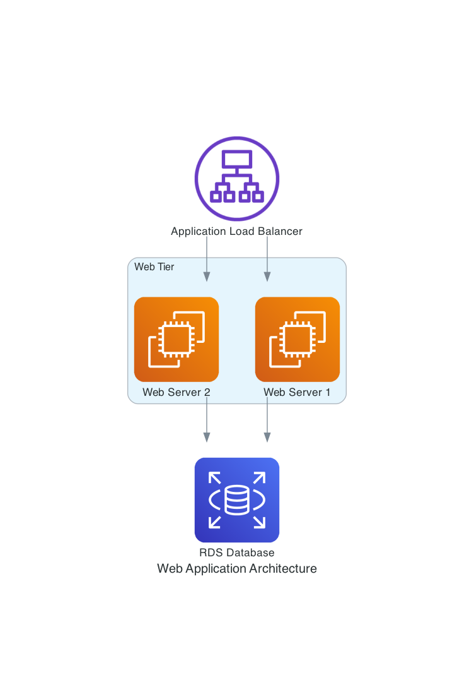

# Diagram Generator Service

## Overview

An async, stateless Python API service that creates infrastructure diagrams using AI agents powered by Large Language Models (LLMs). Users describe diagram components, nodes, or flows in natural language and receive rendered PNG images.

The service uses a **LangGraph-based workflow** with separate planner and executor agents that leverage native tools built around the **diagrams** package for Python.

---

## Architecture

The service implements a **multi-agent workflow** using LangGraph:

* **Planner Agent**: Analyzes user requests and creates detailed execution plans using discovery tools
* **Executor Agent**: Executes plans by building graph structures using construction tools  
* **Graph Builder**: Generates final diagram images from completed graph structures

### Key Features

* **Native Tool Integration**: Custom tools that operate the diagrams package without exposing implementation details to the LLM
* **Stateless Operation**: No user sessions or persistent state required
* **LangGraph Workflow**: React-style agent pattern with conditional routing
* **Comprehensive Provider Support**: Supports all if the nodes from diagrams.
* **Fallback Model Support**: Built-in fallback to alternative LLM models

---

## Requirements Met

✅ **Python + FastAPI**: Async framework with full OpenAPI documentation  
✅ **UV Package Management**: Modern Python package manager with lock files  
✅ **Stateless Service**: No database or session management required  
✅ **Docker + docker-compose**: Full containerization with health checks  
✅ **Custom Diagrams Tools**: 15+ native tools for graph construction and validation  
✅ **LLM Integration**: OpenAI GPT models with Anthropic Claude fallback  
✅ **Visible Prompt Logic**: No opaque framework calls.
✅ **Multiple Node Types**: Support all of them.

---

## Setup and Installation

### Local Development

1. **Prerequisites**: Python 3.11+ and UV package manager
2. **Install dependencies**:
   ```bash
   cd microservices/diagram_agent
   uv sync
   ```

3. **Environment configuration**:
   ```bash
   # Copy and configure environment variables
   cp .env.example .env
   # Edit .env with your API keys
   ```

4. **Run the service**:
   ```bash
   uv run python main.py
   ```

### Docker Deployment

1. **Build and run with docker-compose**:
   ```bash
   docker compose up --build
   ```

2. **Health check**:
   ```bash
   curl http://localhost:8000/health
   ```

### Environment Variables

```bash
# LLM Configuration
OPENAI_API_KEY=your_openai_api_key_here
ANTHROPIC_API_KEY=your_anthropic_api_key_here
MODEL_NAME=gpt-4.1
FALLBACK_MODEL_NAME=claude-3-5-sonnet

# Service Configuration  
HOST=0.0.0.0
PORT=8000
LOG_LEVEL=INFO
RELOAD=false
TEMPERATURE=0.1
```

---

## API Endpoints

### Core Functionality

* **POST `/generate-diagram`**: Generate diagram from natural language description
  - Input: `{"message": "description of diagram"}`
  - Output: PNG image (binary response)

* **GET `/health`**: Service health check
* **GET `/`**: Service information and available endpoints
* **GET `/docs`**: Interactive API documentation

### Example Usage

```bash
# Generate a diagram
curl -X POST "http://localhost:8000/generate-diagram" \
  -H "Content-Type: application/json" \
  -d '{"message": "Create AWS web architecture with ALB, EC2, and RDS"}' \
  --output diagram.png
```

---

## Tool Architecture

### Planner Tools (Discovery)
- `list_all_providers`: Discover available cloud providers
- `list_resources_by_provider`: Find resource categories
- `list_nodes_by_resource`: Get specific node types
- `validate_node_exists`: Verify node class availability

### Executor Tools (Construction)
- `create_node`, `create_edge`, `create_cluster`: Basic graph components
- `create_empty_graph`, `build_graph`: Graph structure management
- `add_node_to_graph`, `add_edge_to_graph`: Incremental building
- `validate_graph`: Structure validation
- `generate_diagram`: Final image generation

---

## Examples

### Example 1: Basic Web Application

**Input:**
```json
{
  "message": "Create a diagram showing a basic web application with an Application Load Balancer, two EC2 instances for the web servers, and an RDS database for storage. The web servers should be in a cluster named 'Web Tier'."
}
```



---

### Example 2: Microservices Architecture

**Input:**
```json
{
  "message": "Design a microservices architecture with three services: an authentication service, a payment service, and an order service. Include an API Gateway for routing, an SQS queue for message passing between services, and a shared RDS database. Group the services in a cluster called 'Microservices'. Add CloudWatch for monitoring."
}
```


---

## Project Structure

```
microservices/diagram_agent/
├── main.py              # FastAPI application entry point
├── agents/
│   ├── diagram_agent.py # LangGraph workflow implementation
│   └── prompts.py       # System prompts for planner/executor
├── api/
│   └── endpoints.py     # FastAPI route definitions
├── tools/
│   └── graph_tools.py   # Native diagram construction tools
├── core/
│   └── graph_structure.py # Graph data models
├── config/
│   ├── settings.py      # Configuration management
│   └── logger.py        # Logging setup
└── tests/               # Unit tests (NOT IMPLEMENTED)
```